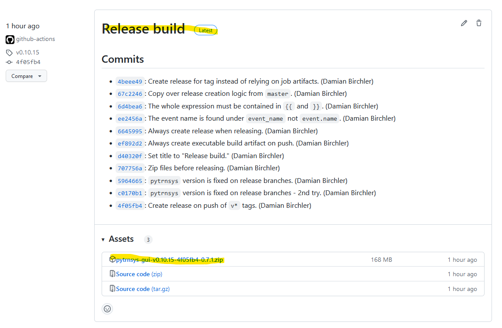
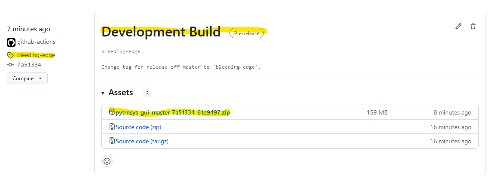

# Graphical user interface for pytrnsys

  

## Overview

A short presentation (15 min) of pytrnsys and its features can be found in the following 
[YouTube video](https://www.youtube.com/watch?v=B1BSjYRKuVM).

## Documentation

You can find the documentation under https://pytrnsys.readthedocs.io/ 

## Installation

You'll need `TRNSYS` (at least version 17, preferably version 18, 32 bit)  installed on your machine.

### Binary installation / User installation

#### Installation

##### Latest stable release

This version is recommended for **non-SPF users** and/or everyone interested in the most recent stable release
possibly missing the latest features.

Go to [Releases](https://github.com/SPF-OST/pytrnsys_gui/releases) and download the `.zip` file included in
the latest Release Build:

(Note that the version will vary as newer versions are being published)

##### Bleeding-edge version

This version is recommended for **SPF users** and/or everyone wanting to get the latest and greatest but not minding the fact
that this version is less stable (i.e. can contain more bugs/errors) than the latest stable release.

Go to [Releases](https://github.com/SPF-OST/pytrnsys_gui/releases) and download the `.zip` file included in
the `bleeding-edge` Development Build:

#### Post-installation

Copy `pytrnsys` custom TRNSYS types in the form of compiled DLLs from

    pytrnsys_data\data\ddcks\dlls
    
to the respective folder of your TRNSYS installation:

    ...\UserLib\ReleaseDLLs

#### Troubleshooting
`pytrnsys-gui.bat` writes logging messages into the `pytrnsys-gui.log` file located in the same directory
as the `.bat` file. The `.log` file might give you some hints as to what happened if something doesn't
work or if `pytrnsys-gui.bat` has crashed.

## Developers
See [DEVELOPER-README.md](DEVELOPER-README.md).