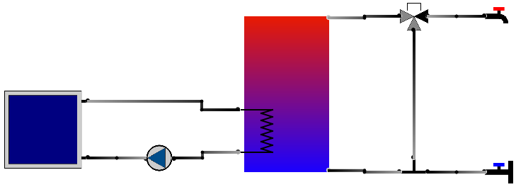
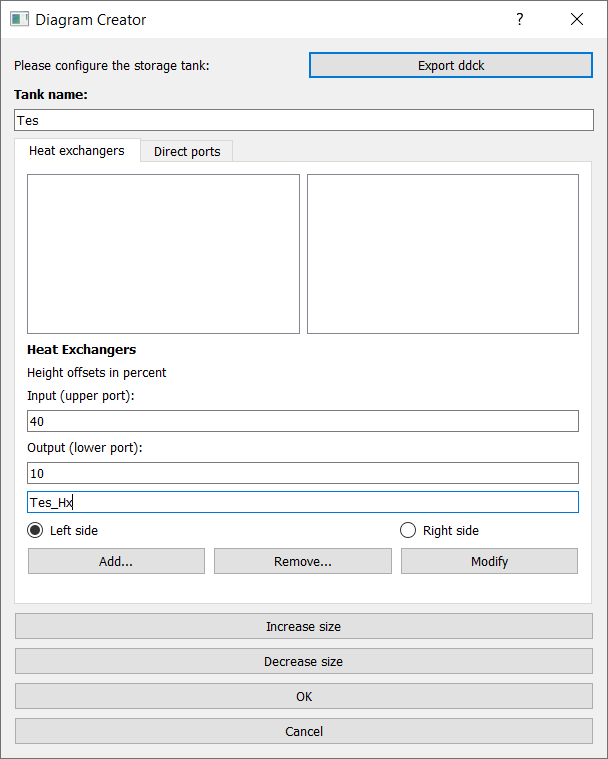
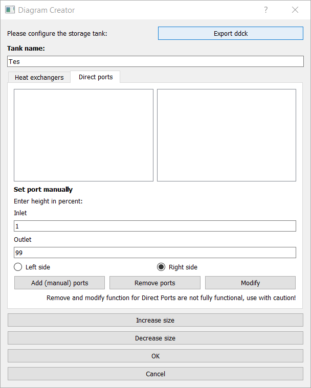

.. _example_procedure:

Complete procedure example
==========================

In the following the step by step procedure for starting with an empty diagram to launching a TRNSYS simulation is
presented. The full diagram of the demonstrated example looks like:

1. Initialize a project
-----------------------

When a new project is initialized the following dialogue is opened to build a folder for the project:

.. image:: ./resources/new_dialog.png
        :width: 600
        :alt: new dialogue

This creates the following file tree:

.. image:: ./resources/example_file_tree.png
        :width: 300
        :alt: file tree

2. Build a diagram
------------------

To make the placement of the components easier the snap grid is toggled.

(i) Set up storage tank
***********************

First, a storage tank is dropped in the diagram. This opens the following dialogue:

.. image:: ./resources/Tes_1.png
        :width: 500
        :alt: Tes 1

To make the diagram better arranged, the size of the storage is increased. Furthermore, its name is changed to ''Tes''.
Then a heat exchanger with its input at 40 % and its output at 10 % height of the storage tank on the left side is
added and named ''Tes_Hx'':

Additionally, a pair of direct ports is added on the right side with the input at 1 % and its output at 99 % height of
the storage tank:

(ii) Place components
*********************

(iii) Connect ports
*******************

3. Load ddck files
------------------

4. Export files and launch TRNSYS simulation
--------------------------------------------

(i) Export Tes.ddck
*******************

(ii) Export hydraulic.ddck
**************************

(iii) Export dck
****************
