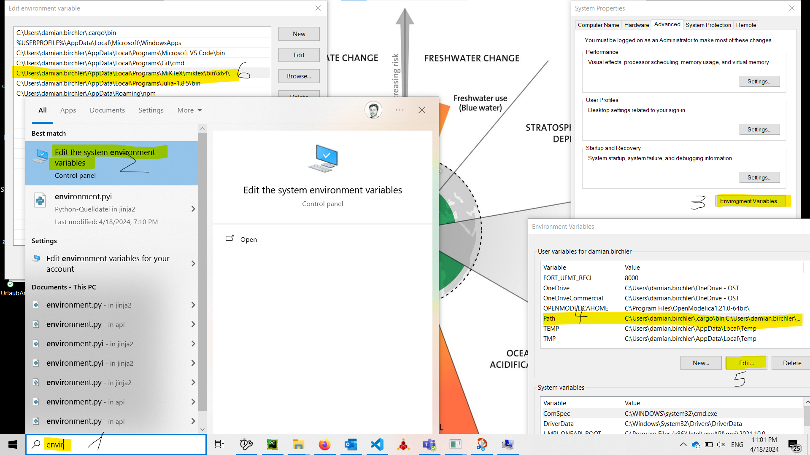
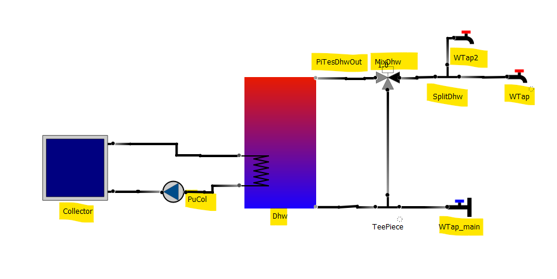

# Workshop

## ...

## General useful links
1. `pytrnsys` GUI [GitHub repository](https://github.com/SPF-OST/pytrnsys_gui)
2. `pytrnsys` [documentation](https://pytrnsys.readthedocs.io/en/latest/index.html)

## Setting the stage - notes to speaker
1. Round of introduction
2. Can record?
3. High level overview - what is `pytrnsys`?
4. TRNSYS - working back from the final deck file.

## Walkthrough

1. Install [MikTex](https://miktex.org/download/ctan/systems/win32/miktex/setup/windows-x64/basic-miktex-24.1-x64.exe).
2. During installation, select "automatically install packages" (wording might differ).
3. Add `MikTex` to your personal path:
   
4. Log out of your machine or restart it for changes to take effect.
5. **Optional**. Install a "good" editor with a built in file browser, e.g. [VS Code](https://code.visualstudio.com/sha/download?build=stable&os=win32-x64-user).
   Very helpful when editing ddck files.
6. Download the `pytrnsys` GUI from [here](https://github.com/SPF-OST/pytrnsys_gui/releases/download/v0.10.23%2Bworkshop/pytrnsys-gui-v0.10.23+workshop-cd555fd-91d1822.zip).
7. Unzip the downloaded zip file.
8. Create new project called `workshop`.
9. Re-create the diagram in the following image:
   
   1. First add the components, name them, then add the pipes between them.
   2. Make sure to name the highlighted components and pipes like in the diagram.
   3. Pipes have a direction (the direction of "positive" mass flow) indicated by a gradient (from light to dark).
      Draw the connections in the "logical" direction.
   4. To show a grid to align all components to click onto an empty area in the diagram and hit the 
      letter "a" on the keyboard.
10. Play around with the mass flow solver.
11. Export hydraulic, storage and placeholders JSON file.
12. Copy over ddcks from example folder.
13. Run simulations.
    1. Debug problems (circulation pipe name).
    2. ...
14. Process cases individually.
15. Process across cases.
